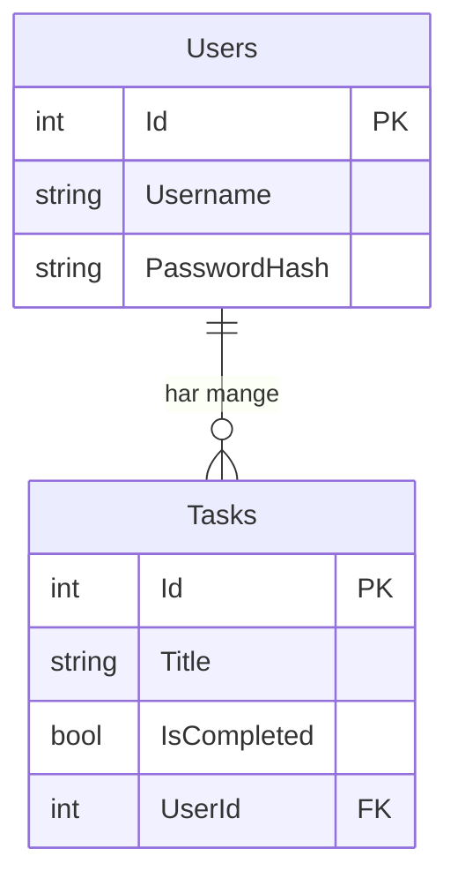

# SecureTaskAPI 🛡️
[](https://github.com/MagnusRasmussen03/SecureTaskAPI/actions/workflows/ci.yml)


# SecureTaskAPI 🛡️

A task management REST API built with C# and .NET 10, PostgreSQL, Docker, and GitHub Actions CI/CD pipeline. Built as a hands-on DevSecOps learning project.

## Tech Stack

- **Language:** C# / .NET 10
- **Database:** PostgreSQL 16
- **ORM:** Entity Framework Core
- **Containerization:** Docker & Docker Compose
- **CI/CD:** GitHub Actions
- **Authentication:** JWT Bearer Tokens
- **Security:** BCrypt password hashing, IDOR protection, Rate limiting

## Architecture

This project follows a layered architecture pattern:

```
Controllers → Services → Repositories → Database
```

- **Controllers** — Handle HTTP requests and responses
- **Services** — Business logic and validation
- **Repositories** — Database access via Entity Framework Core

## Design Patterns

- **Repository Pattern** — Abstracts database access behind interfaces
- **Dependency Injection** — Services and repositories injected via constructor
- **DTO Pattern** — Separate request models from domain models

## API Endpoints

| Method | Endpoint | Auth | Description |
|--------|----------|------|-------------|
| POST | `/auth/register` | ❌ | Create a new user |
| POST | `/auth/login` | ❌ | Login and receive JWT token |
| GET | `/tasks` | ✅ | Get all tasks for logged in user |
| GET | `/tasks/{id}` | ✅ | Get a specific task |
| POST | `/tasks` | ✅ | Create a new task |
| PUT | `/tasks/{id}` | ✅ | Update a task |
| DELETE | `/tasks/{id}` | ✅ | Delete a task |
| GET | `/tasks/statistics` | ✅ | Get task statistics |
| GET | `/tasks/pending` | ✅ | Get pending tasks sorted by title |
| GET | `/admin/users` | 👑 | Get all users with stats |
| GET | `/admin/users/{id}` | 👑 | Get user with tasks |
| DELETE | `/admin/users/{id}` | 👑 | Delete a user |

> ✅ = Requires JWT token — 👑 = Requires admin role

## Security Features

- **JWT Authentication** — Stateless token-based authentication
- **BCrypt Hashing** — Passwords are never stored in plain text
- **IDOR Protection** — Users can only access their own tasks
- **Rate Limiting** — Maximum 2 login attempts per hour per IP
- **Role-based Authorization** — Admin and user roles
- **Environment Variables** — No secrets in source code

## Getting Started

### Prerequisites
- [.NET 10 SDK](https://dotnet.microsoft.com/download)
- [Docker Desktop](https://www.docker.com/products/docker-desktop)

### Run the project locally

1. Clone the repository
```bash
   git clone https://github.com/MagnusRasmussen03/SecureTaskAPI.git
   cd SecureTaskAPI
```

2. Start the database
```bash
   docker-compose up -d db
```

3. Apply database migrations
```bash
   cd SecureTaskAPI
   dotnet ef database update
```

4. Start the API
```bash
   dotnet run
```

The API is now running on `http://localhost:5274`

## API Endpoints

| Method | Endpoint | Description |
|--------|----------|-------------|
| GET | `/tasks` | Get all tasks |
| GET | `/tasks/{id}` | Get a specific task |
| POST | `/tasks` | Create a new task |
| PUT | `/tasks/{id}` | Update a task |
| DELETE | `/tasks/{id}` | Delete a task |

### Example Request

**Create a new task:**
```json
POST /tasks
{
    "title": "Learn Docker",
    "isCompleted": false
}
```

**Response:**
```json
{
    "id": 1,
    "title": "Learn Docker",
    "isCompleted": false
}
```
## Database Diagram



## CI/CD Pipeline

This project uses GitHub Actions for continuous integration. The pipeline automatically triggers on every push to `main` and:

- ✅ Restores all dependencies
- ✅ Builds the project
- ✅ Reports success or failure

## Project Structure
```
SecureTaskAPI/
├── .github/
│   └── workflows/
│       └── ci.yml          # GitHub Actions pipeline
├── SecureTaskAPI/
│   ├── Migrations/         # EF Core database migrations
│   ├── AppDbContext.cs     # Database context
│   ├── TaskItem.cs         # Task model
│   ├── Program.cs          # API endpoints
│   └── appsettings.json    # Configuration
├── docker-compose.yml      # Database container
└── README.md
```

## What I Learned

- Building a REST API with ASP.NET Core and C#
- Database management with PostgreSQL and Entity Framework Core
- Containerization with Docker and Docker Compose
- Setting up CI/CD pipelines with GitHub Actions
- DevSecOps principles and practices